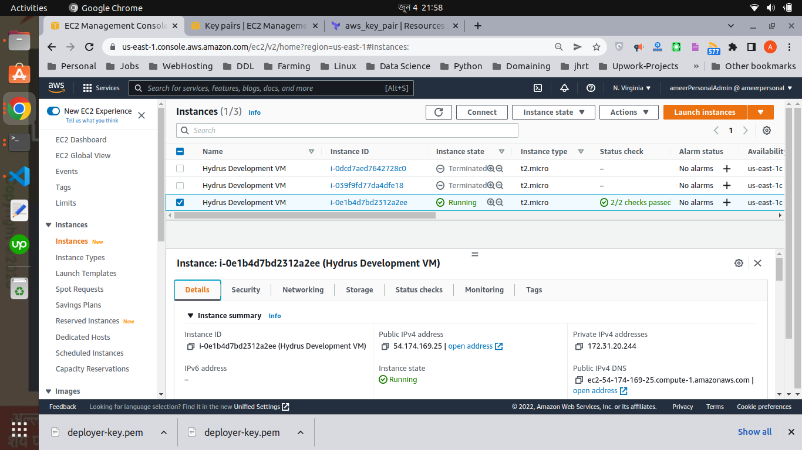
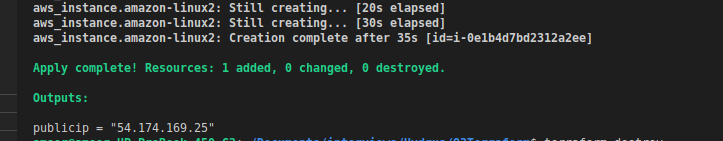

## Deployment instruction

You can deploy it as it is but you need to put/remove the profile information according to yours (I have commented inside)
I kept the public key there but you can't ssh into the instance since port 22 is not enabled and private key is not given. so you need to do your own

### Just use these commands for deployment.
    terraform init
    terraform plan
    terraform apply

### Here is the ec2 built from this terraform on console

### Here is the ip that was returned in output form

