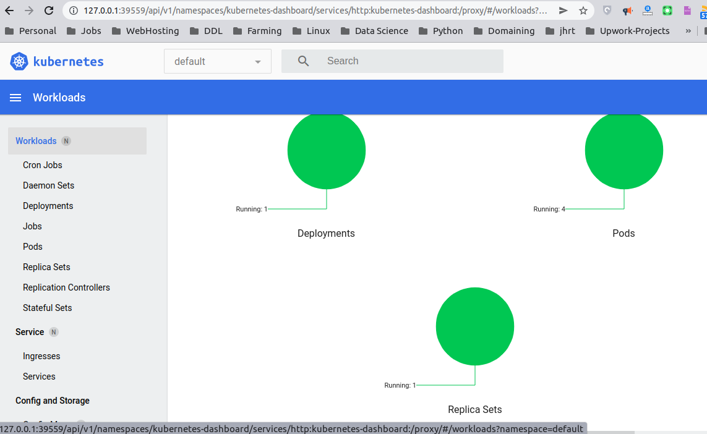

### Please note that I wrote all kubernetes objects in one yml file
deployment.yml whichi is found in manifest folder

### This is get service and get pods command returns

### This is the home page where my cluster result is showing

### This is my minikube dashboard
